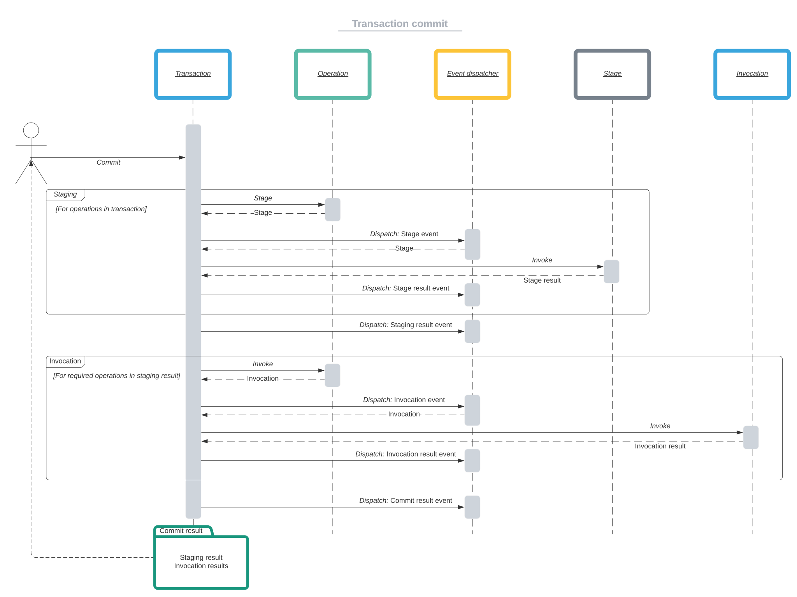
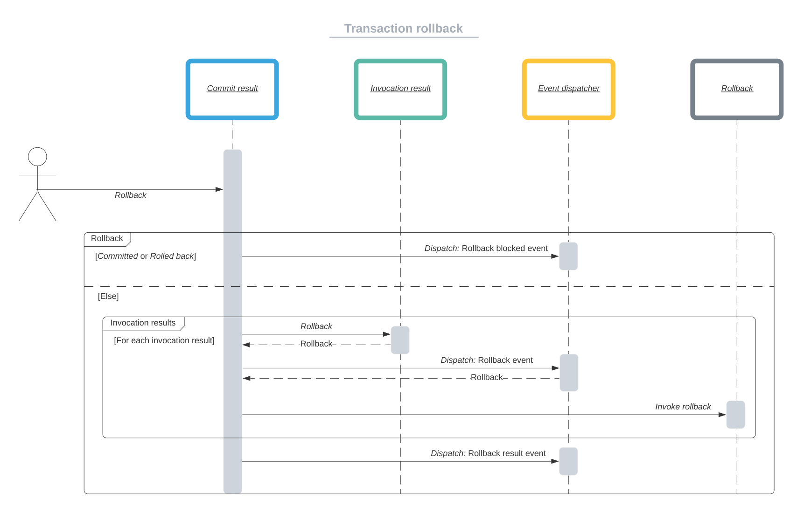

# Transaction

A transaction is a set of operations that can be executed in order.
When a transaction fails, its result can be rolled back, operation by operation,
in reverse order.

There are 3 distinct ways to use transactions:

- [A new transaction instance](#new-transaction-instance)
- [The transaction factory](#factory)
- [The operation handler](operation-handler.md)

## New transaction instance

A transaction can be created as a new object instance:

```php
/** @var \Johmanx10\Transaction\Operation\OperationInterface $operation */
$transaction = new \Johmanx10\Transaction\Transaction(
    $operation,
    $operation,
    $operation
);
```

## Factory

There is a factory, `\Johmanx10\Transaction\TransactionFactory`, that can be
used to create transaction instances:

```php
/** 
 * @var \Johmanx10\Transaction\TransactionFactoryInterface $factory
 * @var \Johmanx10\Transaction\Operation\OperationInterface $operation
 */
$transaction = $factory(
    $operation,
    $operation,
    $operation
);
```

The factory accepts two constructor arguments.

| Argument      | Type                                             | Description |
|:--------------|:-------------------------------------------------|:------------|
| `$dispatcher` | `?\Psr\EventDispatcher\EventDispatcherInterface` | The event dispatcher that is used by the transaction to dispatch [events](events.md). |
| `$strategy`   | `bool`                                           | Whether to execute the operations, or [dry-run](#dry-runs). |

The factory exposes the following constants:

| Constant                                                      | Value   | Intended use |
|:--------------------------------------------------------------|:--------|:-------------|
| `\Johmanx10\Transaction\TransactionFactory::STRATEGY_EXECUTE` | `true`  | Create transactions that will execute operations. |
| `\Johmanx10\Transaction\TransactionFactory::STRATEGY_DRY_RUN` | `false` | Create transactions that will [dry-run](#dry-runs) operations. |

# Dry-runs

To test if a transaction is likely to succeed, the transaction can be replaced
by a dry-run.

A dry-run can be created:

- by creating a new instance of
  `\Johmanx10\Transaction\DryRun` as one would
  `\Johmanx10\Transaction\Transaction`.
  ```php
  $transaction = new \Johmanx10\Transaction\DryRun(
      $operation,
      $operation,
      $operation
  );
  ```
- by constructing the transaction factory with the dry-run strategy:
  ```php
  use Johmanx10\Transaction\TransactionFactory;
  
  $factory = new TransactionFactory(
      strategy: TransactionFactory::STRATEGY_DRY_RUN
  );
  $transaction = $factory(
      $operation,
      $operation,
      $operation
  );
  ```

# Staging

Before operations are executed, the transaction will first enter perform a
staging of the operations.

During staging, the stage can mark the operation as one of the following:

- Staged
- Skipped
- Failed

When an operation is staged, it will be considered required and thus is scheduled
to be executed.

If an operation is marked as skipped, the stage determined that the operation is
not necessary (at this time). E.g.: creating a file that already exists.

A stage that fails will mark the whole staging as failed. Operations that were
previously marked as staged will now also be skipped. However, they will trigger
an invocation result event.

> See [events](events.md) for more information on how to use specific events.

# Commits

Before a commit invokes its operations, it first performs a [staging](#staging).
Based on the result of the staging, a list of required operations is determined.

Depending on the result of the staging, the operations are either invoked or
skipped. Skipped invocations still get dispatched an invocation event and
invocation result event.



The commit result that follows from invoking commit on a transaction, is filled
with the staging result and invocation results. It tells whether the commit was
successful and if not, what the reason was it didn't work as expected.

When wanting to [roll back](#rollbacks), the commit result is used, instead of
the transaction. This makes the transaction stateless and repeatable, although
that is a side effect and not a choice by design.

> See [events](events.md) for more information on how to use specific events.

# Rollbacks

When it is determined that the transaction failed, a rollback can be performed
on the commit result.



Simply call `rollback` on the commit result:

```php
$result = $transaction->commit();

if (!$result->committed()) {
    $result->rollback();
}
```

The commit result will then traverse all invocation results in reverse order and
if it is found that the invocation has been invoked, its specific rollback will
be invoked, until all invocation results have been traversed.

When a second call to `rollback` is made, instead of rolling back the
invocations, it dispatches a rollback blocked event.

To provide a custom rollback mechanism for the entire transactions, simply
provide a callable to the `rollback` method:

```php
$result = $transaction->commit();

if (!$result->committed()) {
    $result->rollback(
        fn () => @unlink('/path/to/lockfile')
    );
}
```

The example above only removes the temporary lock file, but will not restore
anything else that may have been altered by operations. Use this feature with
great caution.

> See [events](events.md) for more information on how to use specific events.

> See the [operation handler](operation-handler.md) for specific behavior
> concerning rollbacks.
